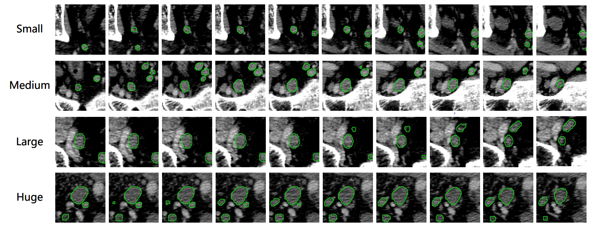

## Meply: A Large-scale Dataset and Baseline Evaluations for Metastatic Perirectal Lymph Node Segmentation

[ https://arxiv.org/pdf/2404.08916](https://arxiv.org/pdf/2404.08916)

### Introduction
The **Metastatic Perirectal Lymph node dataset (MEPLY)**, encompassing **269** enhanced computed tomography (CT) scans with a voxel resolution of 0.625mm, is tailored for the specific task of lymph node segmentation. Annotating each scan meticulously, Meply offers invaluable data facilitating precise delineation of perirectal lymph nodes.

### News
- **MEPLYv2** is now available for download at [https://huggingface.co/datasets/gwd200/MEPLYv2](https://huggingface.co/datasets/gwd200/MEPLYv2).

### Dataset Format
Each CT scan is stored in a compressed numpy file (`.npz`) with the following keys:
- `img`: the CT scan image with shape `(H, W, D)`
- `lbl`: the annotated lymph node mask with shape `(H, W, D)`, 1 for the perirectal lymph node and 0 for the background.
- `spacing`: the voxel spacing in the CT scan with shape `(3,)`

A csv file (`.csv`) is provided for each scan with the following columns:
- `pid`: patient ID
- `target_index`: the index of the target node in the scan
- `volume`: the volume of the target node in voxel units
- `lower z`: the lower z-coordinate of the target node in voxel units
- `lower y`: the lower y-coordinate of the target node in voxel units
- `lower x`: the lower x-coordinate of the target node in voxel units
- `upper z`: the upper z-coordinate of the target node in voxel units
- `upper y`: the upper y-coordinate of the target node in voxel units
- `upper x`: the upper x-coordinate of the target node in voxel units

An sample dataloader for MEPLY is provided in the [prln_dataset.py](prln_dataset.py) file. 