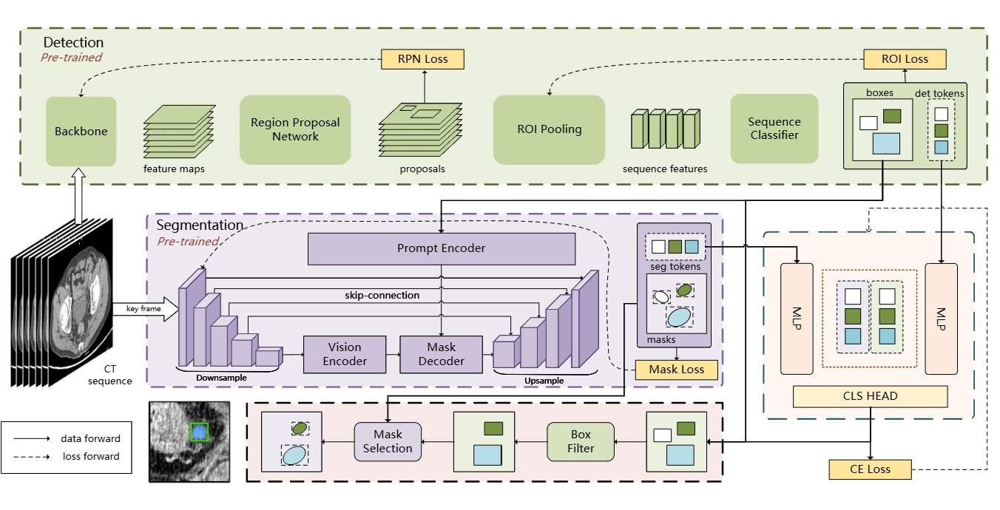

## Meply: A Large-scale Dataset and Baseline Evaluations for Metastatic Perirectal Lymph Node Segmentation

[ https://arxiv.org/pdf/2404.08916](https://arxiv.org/pdf/2404.08916)

### CoSAM Overview
The frame work of our proposed CoSAM. The code of CoSAM is provided in [code/cosam.py](code/cosam.py).

### Dataset Overview
The **Metastatic Perirectal Lymph node dataset (MEPLY)**, encompassing **269** enhanced computed tomography (CT) scans with a voxel resolution of 0.625mm, is tailored for the specific task of lymph node segmentation. Annotating each scan meticulously, Meply offers invaluable data facilitating precise delineation of perirectal lymph nodes.

### Dataset Example
We provide examples of our dataset in npz format. Each npz file contains a dictionary with the following keys:

- `image`: a numpy array of shape (H, W, D) representing the CT sequence.
- `lbl`: a numpy array of shape (H, W, D) representing the ground truth lymph nodesegmentation mask.

An example of how to load the data and visualize it is given in [lymph_dataloader.py](lymph_dataloader.py). 

### Request for Access to the Dataset
If you are interested in our full dataset, please contact <EMAIL> wansh@ustc.edu.cn and provide your organization's information and the purpose of use. 